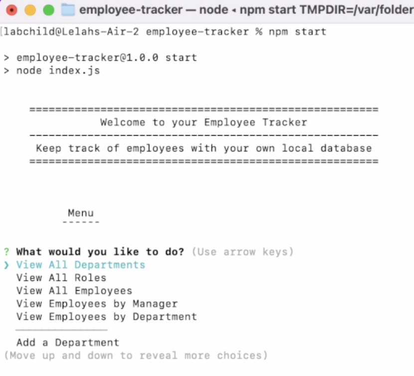
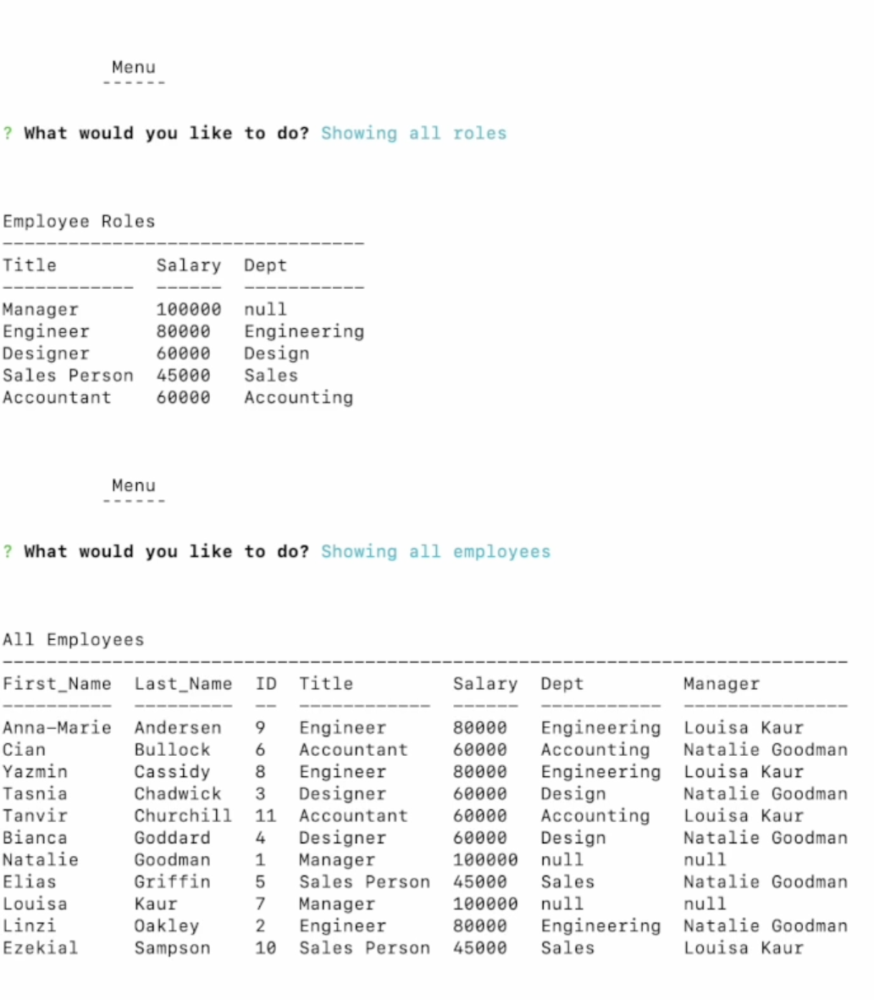
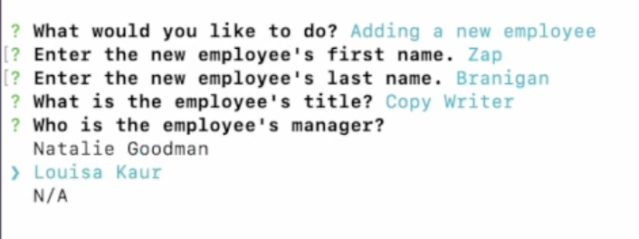

# Employee Tracker 
   

A command-line CMS to manage a company's employee database, using Node.js, Inquirer, and MySQL.

### Table of Contents
* [Description](#description)
* [Installation](#installation)
    * [Prerequisites](#prerequisites)
    * [Getting Started](#getting-started)
* [Usage](#usage)
* [Contributing](#contributing)
* [License](#license)
* [Questions & Contact](#questions-and-contact)
* [Acknowledgements &#x2763;](#acknowledgements)

## Description
Employee Tracker is a Node.js CLI application that allows a company (user) to manage their employee database easily. The app is called and entirely controlled from the CLI, but still easy for non-developers to use. It uses SQL to create, read, update, and delete the database and its records.

## Installation
### Prerequisites
This project requires [MySql](https://dev.mysql.com/downloads/mysql/) and [Node.js](). You can download and install these applications on their respective websites. For a handy step-by-step guide on installing MySQL, check out [this blog](https://coding-boot-camp.github.io/full-stack/mysql/mysql-installation-guide). Follow the instructions for your operating system.

### Getting Started
##### 1 – Install the project
To run this project on your local machine, download or clone this repositiory. Next, navigate to the project's root directory from the command line. Run the following command:
``` 
npm i 
```
##### 2 – Set up your database
Make sure your MySQL database is running. Refer to the [documentation](https://dev.mysql.com/doc/refman/8.0/en/) or this [blog post](https://coding-boot-camp.github.io/full-stack/mysql/mysql-installation-guide) to learn how.

Run the commands ``` source db/db.sql ```, then ``` source db/schema.sql ``` to create your employee database (the order is important). If you'd like to see examples entries, run ``` source db/seeds.sql ``` last.

Your database is now set up and Employee Tracker is installed!

## Usage
A video walkthrough of Employee Tracker is available [here](https://drive.google.com/file/d/1l4q-MZPY3ACWAq2mRAYuNTBQ4vZTCmiN/view?usp=sharing).

To launch Employee Tracker, navigate to the project root folder from your CLI. Run the command ``` npm start ``` or ``` node index.js ```.

Select what you'd like to do from the menu. You can scroll through options with the up and down arrows (there may be more than listed, keep scrolling for additional options). Press ```Enter``` to select that option.



If you selected a "View" option, the records requested will be displayed and you'll be sent back to the main menu.



If you selected an "Add" or "Update" option ("Delete" coming soon), follow the prompts as they appear. When you're done, you will be sent back to the main menu.



You can quit the app from the main menu by selecting the Exit option. You can quit at any time by pressing ```Ctrl```+```C``` (```^C``` on macOS).

## Contributing
This project uses the following packages:
* [Inquirer.js](https://www.npmjs.com/package/inquirer)
* [MySql 2](https://www.npmjs.com/package/mysql2)
* [console.table](https://www.npmjs.com/package/console.table)

## License 
This is an open source project and falls under an [MIT license](./LICENSE.md).

## Questions and Contact
Written by Lelah Bates Childs.

You can find me on GitHub [@labchild](https://github.com/labchild) or [email me](mailto:labchilds@gmail.com). If you have any questions about this project, please reach out.

If you encounter any bugs or other problems, [submit an issue](https://github.com/labchild/employee-tracker/issues).

### Want to Help?
Do you see something I missed or a more succint and effective way this code can be written? Great! Please reach out and let me know how I can improve. Thanks in advance for your tips, tricks, and pointers!

## Acknowledgements
Thank you to my bootcamp instructional team and cohort, for helping me along this journey to become a developer.
